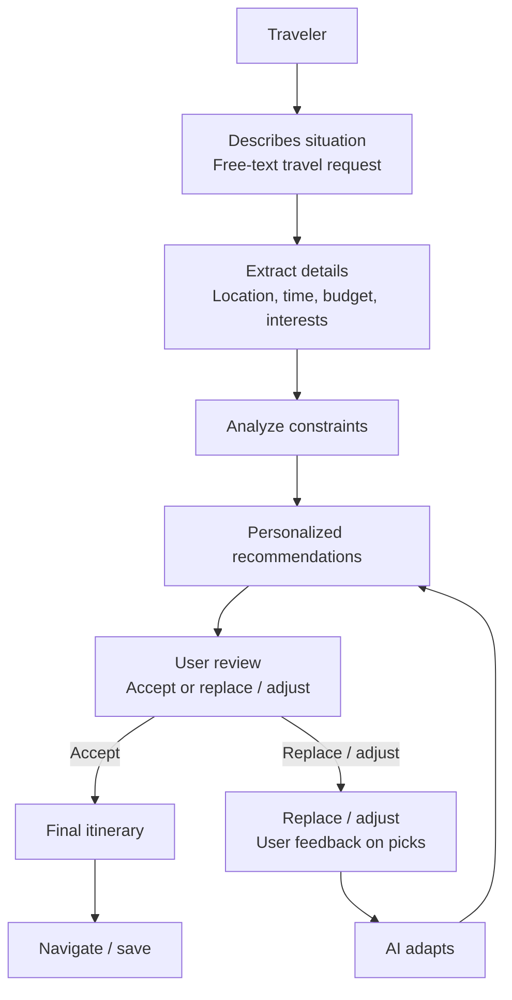

# Travel Recommendation Flow

## Overview

This flow describes how a traveler moves from a free-text travel request to a personalized itinerary, with an iterative feedback loop for replacing or adjusting recommendations.

## Flow



## Detailed Steps

### 1. Traveler

The traveler starts the process by providing a travel request.

### 2. Describes Situation

The traveler describes their situation using a **free-text travel request**.

Examples of information they might provide:

- Where they want to travel
- When they are traveling
- What kind of experience they want
- Any special requirements or preferences

### 3. Extract Details

The system extracts the important travel details from the request:

- **Location**
- **Time**
- **Budget**
- **Interests**

### 4. Analyze Constraints

The AI analyzes the extracted information and identifies constraints that should influence the recommendations.

Possible constraints include:

- Available travel time
- Budget limitations
- Location and distance
- Traveler interests
- Scheduling conflicts
- Other requirements expressed in the request

### 5. Personalized Recommendations

The AI generates personalized recommendations based on the traveler's request, extracted details, interests, and constraints.

### 6. User Review

The traveler reviews the recommendations and chooses one of two paths:

- **Accept** the recommendations
- **Replace / adjust** the recommendations

### 7. Replace / Adjust

If the traveler is not satisfied with one or more recommendations, they provide feedback on the picks.

Examples:

- Replace a destination
- Adjust an activity
- Change the budget
- Change the type of experience
- Request a different recommendation

### 8. AI Adapts

The AI processes the user's feedback and adapts the recommendations accordingly.

The flow then loops back to **Personalized Recommendations**.

This creates an iterative recommendation loop:

> User feedback → AI adapts → Personalized recommendations → User review

### 9. Final Itinerary

When the traveler accepts the recommendations, the system produces the **final itinerary**.

### 10. Navigate / Save

The traveler can then:

- Navigate the itinerary
- Save the itinerary
- Continue using the finalized travel plan

## Decision Flow

```text
Traveler
   ↓
Describes situation
   ↓
Extract details
   ↓
Analyze constraints
   ↓
Personalized recommendations
   ↓
User review
   ├── Accept
   │    ↓
   │  Final itinerary
   │    ↓
   │  Navigate / save
   │
   └── Replace / adjust
        ↓
      User feedback on picks
        ↓
      AI adapts
        ↓
      Personalized recommendations
        ↺
```

## Core Interaction Loop

The key feature of this flow is the **human-in-the-loop recommendation cycle**.

```text
┌──────────────────────────────┐
│ Personalized recommendations │
└──────────────┬───────────────┘
               ↓
        ┌──────────────┐
        │ User review  │
        └──────┬───────┘
               │
        ┌──────┴───────┐
        ↓              ↓
     Accept      Replace / adjust
        ↓              ↓
 Final itinerary    AI adapts
        ↓              │
 Navigate / save     └──────→ Recommendations
```

The **accept path** moves forward to the final itinerary, while the **replace / adjust path** loops back through AI adaptation to generate improved recommendations.
